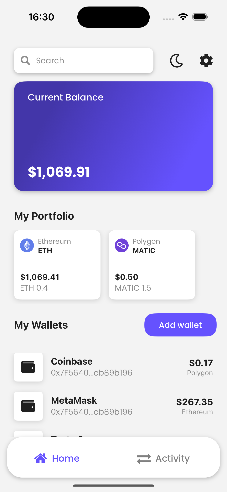
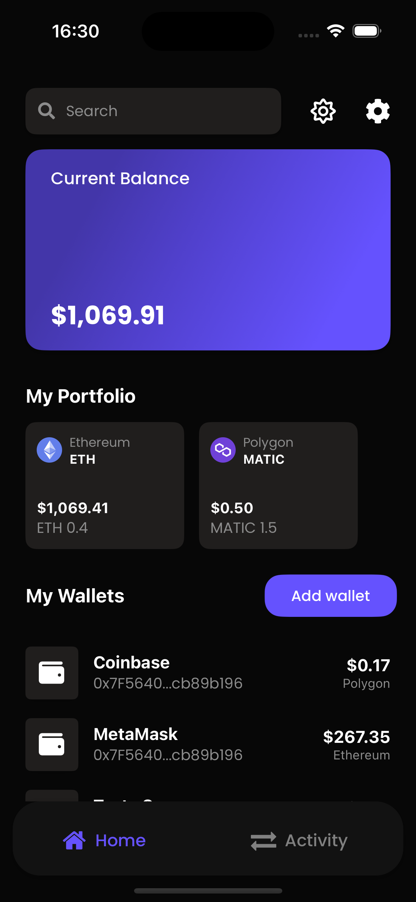
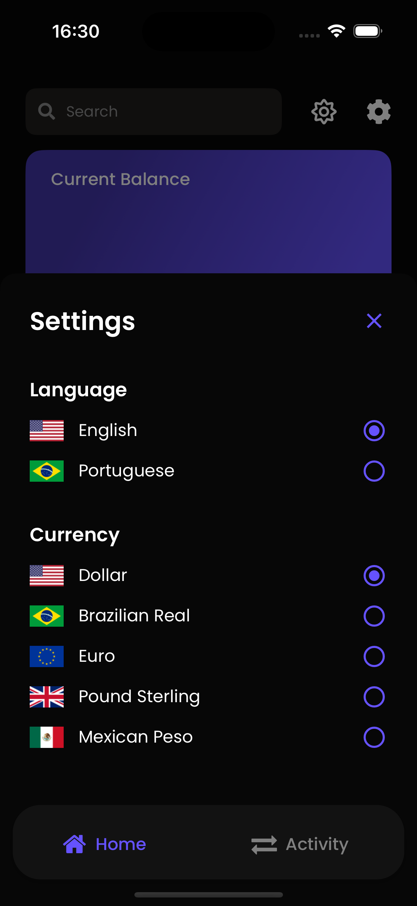
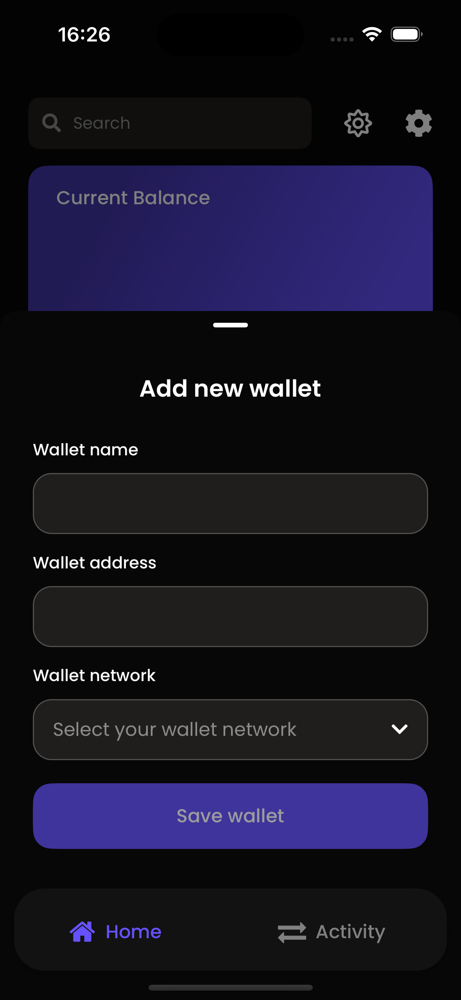
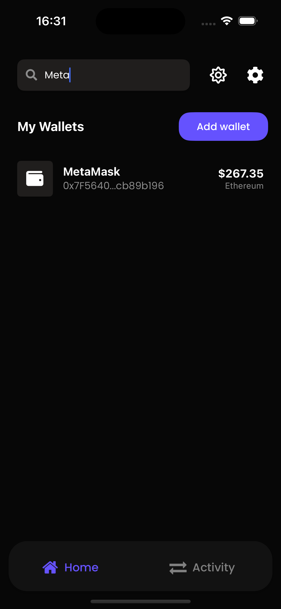

# CryptoKeep

CryptoKeep is an intuitive app for managing your cryptocurrency portfolio. Add wallet addresses, view individual and total balances, and track asset holdings—all in one place.

## 📱 Screens







## 🧪 Tech Stack

- React Native
- Expo
- Expo Router
- React Query
- Tailwind CSS
- Zustand
- Expo-SQLite
- Alchemy

## 🚀 Getting started

Clone the project and access the folder:

```bash
$ git clone https://github.com/raulval/CryptoKeep-app.git && cd CryptoKeep-app
```

Follow the steps below:

```bash
# Install all dependencies
$ bun i

# Start the project in simulator
$ bunx expo start --ios
#or
$ bunx expo start --android

```

## 👤 Links

- [LinkedIn](https://www.linkedin.com/in/raulval/)
- [Twitter](https://twitter.com/raul_val)
- [Telegram](https://t.me/raul_val)

## 📝 License

This project is licensed under the MIT License. See the [LICENSE](LICENSE.md) file for details.
